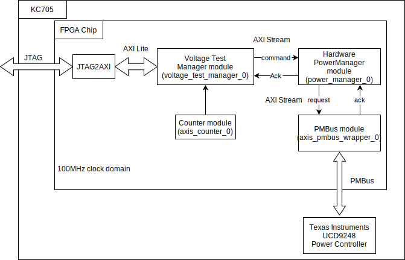
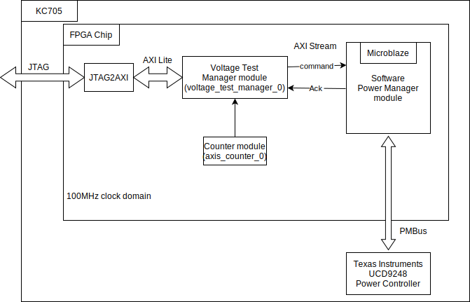

# VolTune

VolTune is an FPGA-integrated runtime voltage control framework for PMBus-controlled FPGA platforms. It provides a structured control plane for runtime rail tuning, voltage readback, and experimental characterization, while abstracting low-level PMBus transaction details behind FPGA-resident control logic. In this repository, VolTune is instantiated on the Xilinx Kintex-7 KC705 platform with a TI UCD9248 programmable power controller.

This repository accompanies the VolTune arXiv paper and contains the design artifacts used to build the controller, generate bitstreams, and run representative voltage, power, latency, and BER experiments.

**Paper:** [arXiv link, to be added]

## Overview

VolTune exposes board-level voltage control as a runtime architectural mechanism inside the FPGA platform. Rather than relying on manual board-level intervention or ad hoc external control, VolTune integrates the voltage-control path into the FPGA system through a command-driven interface that can be invoked at runtime. The design is intended as a reusable control mechanism, not as a fixed optimization policy.

In the current prototype:

- The target platform is the **Xilinx Kintex-7 KC705**
- Voltage control is performed through the **TI UCD9248** programmable power controller
- The repository includes **two control paths**:
  - a **hardware control path** implemented in FPGA logic
  - a **software control path** implemented on **MicroBlaze**
- The representative case study focuses on the **GTX transceiver supply rail (`MGTAVCC`)**

## Control paths

### Hardware control path



The hardware control path implements the PowerManager subsystem directly in FPGA logic. In this path, the Voltage Test Manager issues structured commands to the Hardware PowerManager, which translates them into PMBus requests through the PMBus module and applies the requested voltage updates through the UCD9248 power controller.

This path is suitable when voltage control must remain lightweight, deterministic, and tightly coupled with runtime FPGA activity.

### Software control path



The software control path implements the PowerManager subsystem on a MicroBlaze soft processor. It preserves the same high-level command semantics as the hardware implementation, while replacing the dedicated logic controller with a processor-based control subsystem connected through AXI peripherals.

This path is more flexible and easier to extend, but it requires additional processor, memory, and interconnect infrastructure.

## Repository layout

```text
.
├── build_device.sh          # FPGA build entry point
├── msys_install.sh          # Install MSYS2-side build dependencies
├── msys_build.sh            # Build Windows host tools
├── device/                  # FPGA-side sources
│   ├── hls/                 # Vitis HLS modules
│   ├── rtl/                 # RTL modules, including PMBus-related logic
│   ├── ip/                  # IP generation scripts and wrappers
│   ├── vivado/              # Vivado project and design variants
│   └── vitis_src/           # Vitis-side sources for the software control path
├── host/                    # Windows host applications
│   ├── voltage/             # Voltage measurement host tool
│   ├── power/               # BER / power / latency host tool
│   ├── evm/                 # Auxiliary host utilities
│   └── xsdb_wrapper/        # XSDB interaction layer
├── experiments/             # Sample configs and helper scripts
└── docs/                    # Documentation assets and figures
```

## Platform and tool requirements

### FPGA build environment

- Ubuntu 20.04
- bash
- CMake 3.16 or newer
- Make
- Vivado 2022.1
- Vitis 2022.1
- Vitis HLS 2022.1

### Host execution environment

- Windows 10
- MSYS2
- gcc
- CMake 3.16 or newer
- Make
- Vivado Lab 2022.1 or Vivado 2022.1
- `hw_server`
- `xsdb`

## Build

### 1. Build FPGA designs on Ubuntu

From the repository root:

```bash
./build_device.sh all
```

Generated bitstreams are placed under:

```text
build/bitstream/
```

### 2. Build Windows host tools with MSYS2

Open the MSYS2 MinGW64 shell and, from the repository root, run:

```bash
./msys_install.sh
./msys_build.sh
```

If the build succeeds, the host executables are generated under:

```text
build/bin/
```

Main executables:

- `build/bin/voltage-measure.exe`
- `build/bin/power-measure.exe`

## Running experiments

### A. Voltage transition measurement

The voltage measurement flow programs a selected rail, records PMBus-based voltage samples, and exports settling-time related CSV outputs.

Typical usage:

```bash
voltage-measure.exe <CONFIG_FILE> [OPTIONS]
```

Typical options include:

- `-b <dir>` bitstream directory
- `-c <MHz>` external clock frequency
- `-o <file>` summary result CSV
- `-O <dir>` per-test voltage trace output directory
- `-s <100k|400k|1m>` PMBus speed
- `-sw` software control path only
- `-hw` hardware control path only

Representative input files and helper scripts:

- `experiments/sample_voltage.csv`
- `experiments/sample_voltage_7p5.csv`
- `experiments/msys_voltage_run.sh`

### B. BER / power / latency measurement

The BER / power measurement flow sweeps operating points and records error rate, latency, and rail power statistics.

Typical usage:

```bash
power-measure.exe <CONFIG_FILE> [OPTIONS]
```

Typical options include:

- `-b <dir>` bitstream directory
- `-c <MHz>` external clock frequency
- `-o <file>` result CSV
- `-s <100k|400k|1m>` PMBus speed
- `-r <N>` repeated runs
- `-i` invert TX/RX device roles
- `-sw` software control path only
- `-hw` hardware control path only

Representative input files and helper scripts are available under `experiments/`.

## Notes and limitations

- This repository is a research artifact, not a productized software package.
- The public release preserves build-critical identifiers where changing them could break Vivado, Vitis, HLS, or IP integration.
- The current implementation and evaluation flow are centered on the **KC705 + UCD9248** platform.
- The transceiver case study is a representative demonstration, not a claim of universal behavior across all rails or all FPGA platforms.
- Clock-board setup is not automated by the host tools and must be prepared separately.
- If a PMBus-related test fails unexpectedly, power-cycle the KC705 before retrying.

## Citation

If you use this repository in your research, please cite:

```bibtex
@misc{voltune_arxiv_2026,
  title        = {VolTune: A Fine-Grained Runtime Voltage Control Architecture for FPGA Systems},
  author       = {Akram BEN AHMED and Takahiro Hirofuchi and Takaaki Fukai},
  year         = {2026},
  archivePrefix= {arXiv},
  eprint       = {XXXX.XXXXX}
}
```

## Contact

The Continuum Computing Architecture Research Group (CCARG), the Intelligent Platforms Research Institute, the National Institute of Advanced Industrial Science and Technology (AIST), Japan.

E-mail: <M-digiarc-ccirt-contact-ml@aist.go.jp>

We are hiring postdocs and technical staff. Collaborations are also welcome.

## Acknowledgment

This work is partially supported by JSPS KAKENHI Grant Number ZBA2029720A.

## Licensing

Copyright (c) 2024-2026 National Institute of Advanced Industrial Science and Technology (AIST)  
All rights reserved.

This software is released under the [MIT License](LICENSE).

See also [THIRD_PARTY_NOTICES.md](THIRD_PARTY_NOTICES.md) for files and materials that are excluded from the repository-wide MIT License.

