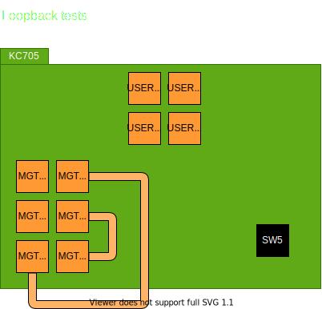
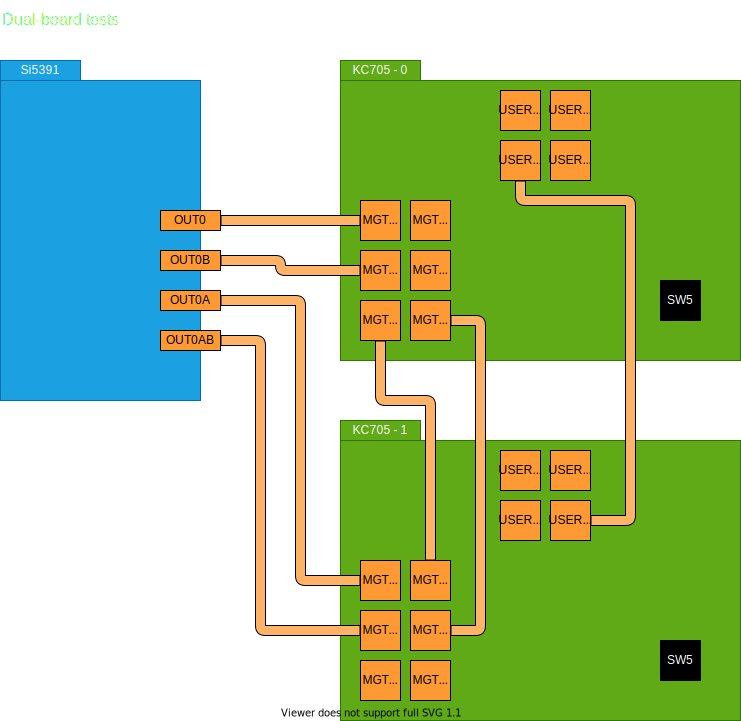
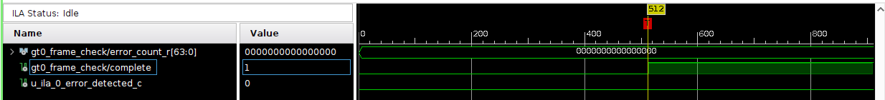

# design-example

## What is this directory ?

This directory contains design example which received from AIST and modified design.  
In `loopback-<speed>` directories, Loopback test design is contained.  
In `dual-board-<speed>` directories, Dual-board test design is contained.  
`<speed>` value represents the speed of Gigabit Transceiver (GT).  
e.g.

- 5g: 5 GT/s
- 10g: 10 GT/s

## How to test

### Hardware connection





### Clock board setup (Dual-board tests only)

Please refer to [clock-board-quick-setup.md](../power/clock-board-quick-setup.md)

### Write bitstream & ILA setup

For writing bitstream, please refer to [Programming the Device](https://docs.xilinx.com/r/2022.1-English/ug908-vivado-programming-debugging/Programming-the-Device) or [Embedded System Tools Reference Manual P.58](https://docs.xilinx.com/v/u/2015.2-English/ug1043-embedded-system-tools#page=58)  
For setting up ILA, please refer to [Setting Up the ILA Core to Take a Measurement](https://docs.xilinx.com/r/2022.1-English/ug908-vivado-programming-debugging/Setting-Up-the-ILA-Core-to-Take-a-Measurement)  
When dual-board tests, setting up ILA of receive side board. (KC705-1)

### Start tests

Watching ILA and push SW5 button and watching ILA.  
When dual-board tests, push SW5 button of send side board. (KC705-0)

Few minutes later, "complete" signal will be asserts.  
You can see BER at "error_count_r" value.



## Directories

```
├── dual-board-5g : dual-board test @  5 GT/s
├── dual-board-10g: dual-board test @ 10 GT/s
└── loopback-5g   : loopback test   @  5 GT/s
```
