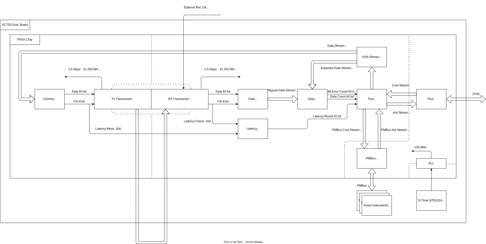
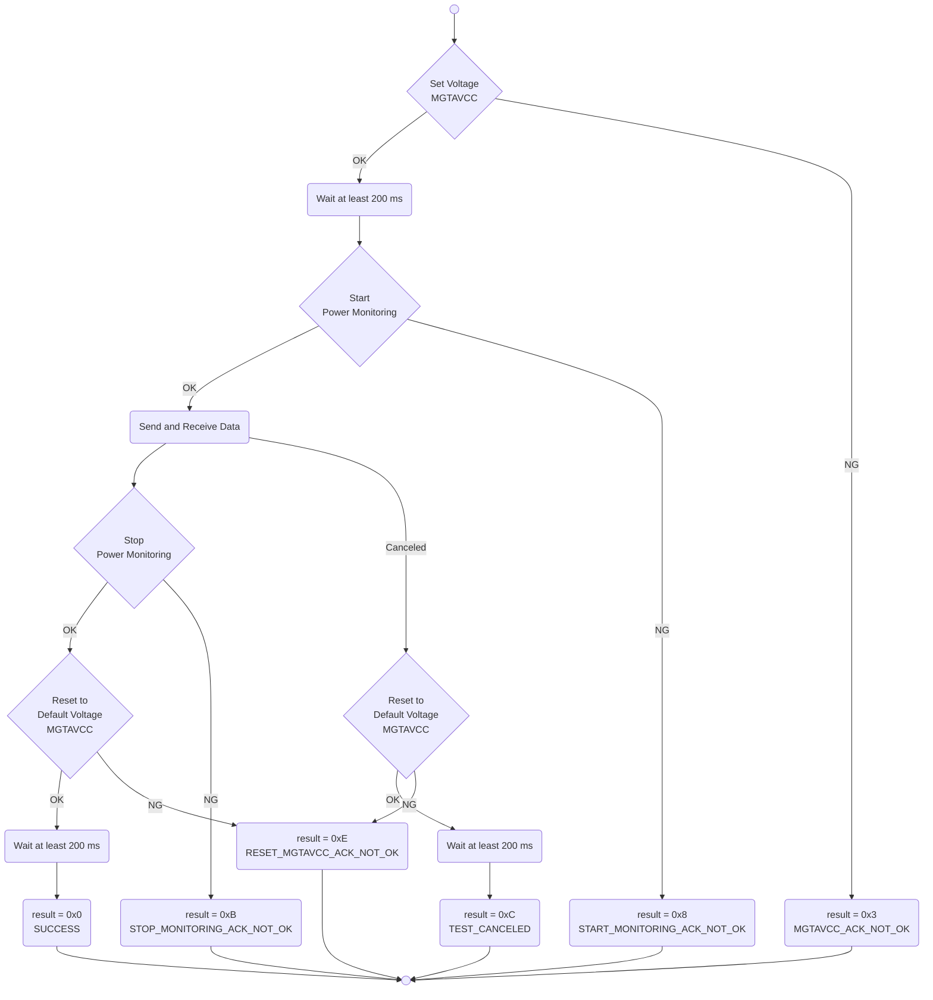

# Loopback Design, 10 Gbps

This directory contains the loopback design with transceivers set to 10 Gbps.

This design is used for BER, latency, and power measurement in the VolTune power-oriented transceiver case study.

## Overview

This is the single-board loopback design for the test flow.

## Block diagram

## Flowchart

## Typical error codes

Typical error codes are listed below. If you encounter another value, please refer to the error code definitions in [test_app_base.cpp](../../../../hls/test_app_base/src/test_app_base.cpp).

### result = 0x0: SUCCESS

- No error occurred during testing.

### result = 0x3: MGTAVCC_ACK_NOT_OK

- Error occurred when setting voltage.
- First, power down test target to prevent damage.
- Please check voltage lane, value, and PMBus speed.

### result = 0x8: START_MONITORING_ACK_NOT_OK

- Error occurred when starting power monitoring.
- Please check voltage lane and PMBus speed.

### result = 0xB: STOP_MONITORING_ACK_NOT_OK

- Error occurred when stopping power monitoring.
- First, power down test target to prevent damage.
- Please check voltage lane and PMBus speed.

### result = 0xC: TEST_CANCELED

- The test is canceled by user.

## Address map

| Address     | Bits   | R/W  | Name           | Description |
| ----------- | ------ | ---- | -------------- | ----------- |
| 0x0000_0010 | [63:0] | R/W  | i2cClockSelect | PMBus speed. "0: 100kHz", "1: 400kHz" or "2: 1MHz". |
| 0x0000_0020 | [63:0] | R/W  | test_voltage   | Test voltage of MGTAVCC. |
| 0x0000_1000 | [63:0] | R/W  | test_pattern   | Test pattern. "0: All Zero", "1: All Hi" or "2: Count Up". |
| 0x0000_1010 | [63:0] | R/W  | test_size      | Test size. This value is aligned to 8 Byte. |
| 0x0000_2000 | [63:0] | R    | result         | Result value of test. Please refer to the **Typical error codes** section. |
| 0x0000_2010 | [63:0] | R    | error_bit_cnt  | Error bit count. |
| 0x0000_2020 | [63:0] | R    | latency        | Cycle count between sending first data and receiving first data. |
| 0x0000_2030 | [63:0] | R    | min_power      | Minimum power value while testing. |
| 0x0000_2040 | [63:0] | R    | max_power      | Maximum power value while testing. |
| 0x0000_2050 | [63:0] | R    | sum_power      | Accumulated power value while testing. |
| 0x0000_2060 | [63:0] | R    | sum_power2     | Accumulated squared power value while testing. |
| 0x0000_2070 | [63:0] | R    | sum_count      | Cycle count value while testing. |
| 0x0000_2080 | [63:0] | R    | data_byte_cnt  | Received data size. |
| 0x0001_0000 | [0]    | R/W  | start          | Start test when this value is changed from 0 to 1. |
| 0x0001_0000 | [2]    | R    | idle           | Indicate that you can start test. |
| 0x0002_0000 | [0]    | R/W  | start_counting | Start counting external clock when this value is changed from 0 to 1. |
| 0x0002_0008 | [30:0] | R    | counted_cycle  | Counted external clock cycle in 100 ms. |
| 0x0002_0008 | [31]   | R    | counting_done  | Indicate that counting external clock is done or not. |
| 0x0003_0000 | [0]    | R/W  | cancel_test    | Cancel test application when this value is 1. |
| 0x0003_0008 | [0]    | R/W  | cancel_pmbus   | Cancel PMBus access when this value is 1. |

## LED

- `[1:0]`: TX, RX or Loopback
  - `2'b00`: Reserved
  - `2'b01`: TX
  - `2'b10`: RX
  - `2'b11`: Loopback
- `[3:2]`: Speed
  - `2'b00`: 2.5 Gbps
  - `2'b01`: 5.0 Gbps
  - `2'b10`: 7.5 Gbps
  - `2'b11`: 10.0 Gbps
- `[4]`: Blinking according to internal clock
- `[5]`: Blinking according to external clock
- `[6]`: Lighting during testing
- `[7]`: Lighting when test result is not OK

## Related files

- [`../README.md`](../README.md), parent 10 Gbps design overview
- [`../../README.md`](../../README.md), parent power-oriented designs
- [`../../test/README.md`](../../test/README.md), test-script details
