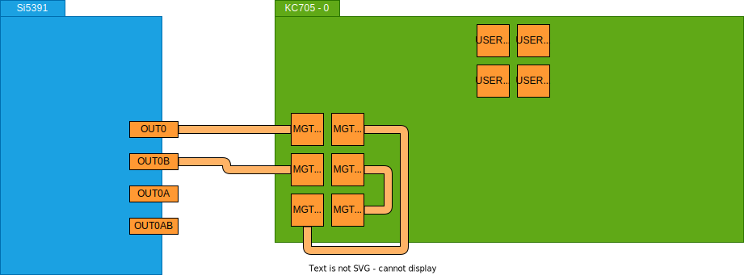
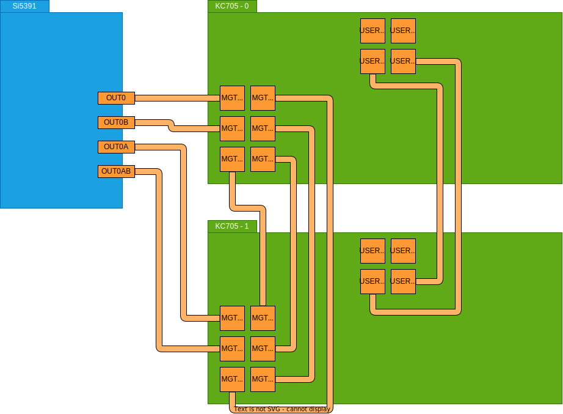

# Power-oriented Designs

This directory contains the Vivado designs and projects used for BER and latency measurement in the VolTune repository. Quantitative operating boundaries are specific to this board, regulator configuration, and workload, and should not be generalized without separate characterization.

It is the main design hierarchy for the representative transceiver case study and includes design variants for multiple line rates, single-board loopback tests, dual-board TX/RX tests, and both hardware-based and software-based PMBus control paths.

For PMBus concepts, data formats, command usage, and the subset of PMBus behavior relevant to this repository, see [`../../../docs/PMBUS.md`](../../../docs/PMBUS.md).

## Scope

The `power/` hierarchy contains designs for:

- **single-board loopback tests**
- **dual-board TX/RX tests**
- **multiple transceiver line rates**, 2.5 Gbps, 5 Gbps, 7.5 Gbps, and 10 Gbps
- **two PMBus control implementations**:
  - hardware-based PMBus control
  - software-based PMBus control, under [`swpmbus/`](swpmbus/)

## Build

Input the following commands.

After that, bitstreams are generated in `<Repository_top>/build/bitstream/power`.

```bash
$ cd <Repository_top>
$ mkdir build && cd build
$ cmake -DVIVADO_ROOT=<Path_to_Vivado_2022.1> -DVITIS_HLS_ROOT=<Path_to_Vitis_HLS_2022.1> -DVITIS_ROOT=<Path_to_Vitis_2022.1> ../device
# e.g. $ cmake -DVIVADO_ROOT=/opt/Xilinx/Vivado/2022.1 -DVITIS_HLS_ROOT=/opt/Xilinx/Vitis_HLS/2022.1 -DVITIS_ROOT=/opt/Xilinx/Vitis/2022.1 ../device
$ make impl_<Target_direction>_<Target_speed>
# e.g. $ make impl_loopback_10g
```

### `<Target_direction>` list

- `loopback`
  - Design for single-board test
- `tx`
  - Design for TX side of dual-board test
- `rx`
  - Design for RX side of dual-board test

### `<Target_speed>` list

- `2p5g`
  - Transceivers are set to 2.5 Gbps
- `5g`
  - Transceivers are set to 5 Gbps
- `7p5g`
  - Transceivers are set to 7.5 Gbps
- `10g`
  - Transceivers are set to 10 Gbps

### Target list

#### Hardware-control targets

- `impl_tx_10g`
- `impl_rx_10g`
- `impl_loopback_10g`
- `impl_tx_7p5g`
- `impl_rx_7p5g`
- `impl_loopback_7p5g`
- `impl_tx_5g`
- `impl_rx_5g`
- `impl_loopback_5g`
- `impl_tx_2p5g`
- `impl_rx_2p5g`
- `impl_loopback_2p5g`

#### Software-control targets

- `bit_tx_10g_swpmbus_vitis`
- `bit_rx_10g_swpmbus_vitis`
- `bit_loopback_10g_swpmbus_vitis`
- `bit_tx_7p5g_swpmbus_vitis`
- `bit_rx_7p5g_swpmbus_vitis`
- `bit_loopback_7p5g_swpmbus_vitis`
- `bit_tx_5g_swpmbus_vitis`
- `bit_rx_5g_swpmbus_vitis`
- `bit_loopback_5g_swpmbus_vitis`
- `bit_tx_2p5g_swpmbus_vitis`
- `bit_rx_2p5g_swpmbus_vitis`
- `bit_loopback_2p5g_swpmbus_vitis`

### Bitstream list

#### Using HW-based PMBus

- `hw_l025_c125_000.bit`: Loopback, 2.5 Gbps
- `hw_t025_c125_000.bit`: TX, 2.5 Gbps
- `hw_r025_c125_000.bit`: RX, 2.5 Gbps
- `hw_l050_c125_000.bit`: Loopback, 5 Gbps
- `hw_t050_c125_000.bit`: TX, 5 Gbps
- `hw_r050_c125_000.bit`: RX, 5 Gbps
- `hw_l075_c117_188.bit`: Loopback, 7.5 Gbps
- `hw_t075_c117_188.bit`: TX, 7.5 Gbps
- `hw_r075_c117_188.bit`: RX, 7.5 Gbps
- `hw_l100_c125_000.bit`: Loopback, 10 Gbps
- `hw_t100_c125_000.bit`: TX, 10 Gbps
- `hw_r100_c125_000.bit`: RX, 10 Gbps

#### Using SW-based PMBus

- `sw_l025_c125_000.bit`: Loopback, 2.5 Gbps
- `sw_t025_c125_000.bit`: TX, 2.5 Gbps
- `sw_r025_c125_000.bit`: RX, 2.5 Gbps
- `sw_l050_c125_000.bit`: Loopback, 5 Gbps
- `sw_t050_c125_000.bit`: TX, 5 Gbps
- `sw_r050_c125_000.bit`: RX, 5 Gbps
- `sw_l075_c117_188.bit`: Loopback, 7.5 Gbps
- `sw_t075_c117_188.bit`: TX, 7.5 Gbps
- `sw_r075_c117_188.bit`: RX, 7.5 Gbps
- `sw_l100_c125_000.bit`: Loopback, 10 Gbps
- `sw_t100_c125_000.bit`: TX, 10 Gbps
- `sw_r100_c125_000.bit`: RX, 10 Gbps

## Test flows

### Single-board test

#### Hardware connection



#### Clock board setup

Please refer to [`clock-board-quick-setup.md`](./clock-board-quick-setup.md).

#### Write bitstream

Write loopback design to KC705.

For writing bitstream, please refer to [Programming the Device](https://docs.xilinx.com/r/2022.1-English/ug908-vivado-programming-debugging/Programming-the-Device) or [Embedded System Tools Reference Manual P.58](https://docs.xilinx.com/v/u/2015.2-English/ug1043-embedded-system-tools#page=58).

#### Run test

Input the following commands.

Please refer to [`test/README.md`](./test/README.md) about test details.

```bash
$ cd <Repository_top>/build
$ make power_test_loopback
rlwrap: warning: your $TERM is 'xterm-256color' but rlwrap couldn't find it in the terminfo database. Expect some problems.
Test size (aligned to 8 Byte)
      10000000080 [Byte]

Wait for test ending...
   10000:   00000000

   10000:   00000000

   10000:   00000000

   10000:   00000000

   10000:   00000000

   10000:   00000000

   10000:   00000000

   10000:   00000000

   10000:   00000000

   10000:   00000000

   10000:   00000004

Recv data size [Byte] (lower 32 bit)
    2080:   540BE450

Recv data size [Byte] (upper 32 bit)
    2084:   00000002

Error bit count (lower 32 bit)
    2010:   00000000

Error bit count (upper 32 bit)
    2014:   00000000

Latency
    2020:   0000000D

Result
    2000:   00000000

Min Power
    2030:   00000678

Max Power
    2040:   00000878

Sum Power   (lower 32 bit)
    2050:   012DACBC

Sum Power   (upper 32 bit)
    2054:   00000000

Sum Power 2 (lower 32 bit)
    2060:   8C5CEE10

Sum Power 2 (upper 32 bit)
    2064:   00000008

Sum Count
    2070:   000029AB

Built target power_test_loopback
```

### Dual-board test

#### Hardware connection



#### Clock board setup

Please refer to [`clock-board-quick-setup.md`](./clock-board-quick-setup.md).

#### Write bitstream

Write TX design to KC705-0 and RX design to KC705-1.

For writing bitstream, please refer to [Programming the Device](https://docs.xilinx.com/r/2022.1-English/ug908-vivado-programming-debugging/Programming-the-Device) or [Embedded System Tools Reference Manual P.58](https://docs.xilinx.com/v/u/2015.2-English/ug1043-embedded-system-tools#page=58).

#### Run test

Input the following commands.

Please refer to [`test/README.md`](./test/README.md) about test details.

```bash
$ cd <Repository_top>/build
$ make power_test_dual
rlwrap: warning: your $TERM is 'xterm-256color' but rlwrap couldn't find it in the terminfo database. Expect some problems.
Test size (aligned to 8 Byte)
      10000000080 [Byte]

Wait for test ending...
   10000:   00000000

   10000:   00000000

   10000:   00000000

   10000:   00000000

   10000:   00000000

   10000:   00000000

   10000:   00000000

   10000:   00000000

   10000:   00000000

   10000:   00000000

   10000:   00000004

Recv data size [Byte] (lower 32 bit)
    2080:   540BE450

Recv data size [Byte] (upper 32 bit)
    2084:   00000002

Error bit count (lower 32 bit)
    2010:   00000000

Error bit count (upper 32 bit)
    2014:   00000000

Latency
    2020:   0000000B

RX Result
    2000:   00000000

RX Min Power
    2030:   00000482

RX Max Power
    2040:   00000688

RX Sum Power   (lower 32 bit)
    2050:   00E6E622

RX Sum Power   (upper 32 bit)
    2054:   00000000

RX Sum Power 2 (lower 32 bit)
    2060:   FFB86D84

RX Sum Power 2 (upper 32 bit)
    2064:   00000004

RX Sum Count
    2070:   000029C3

TX Result
    2000:   00000000

TX Min Power
    2030:   0000057E

TX Max Power
    2040:   00000788

TX Sum Power   (lower 32 bit)
    2050:   011141B2

TX Sum Power   (upper 32 bit)
    2054:   00000000

TX Sum Power 2 (lower 32 bit)
    2060:   05053F5C

TX Sum Power 2 (upper 32 bit)
    2064:   00000007

TX Sum Count
    2070:   000029AB
```

## Directory map

```text
power/
├── 2p5g/
│   ├── loopback/   # Loopback design with transceivers set to 2.5 Gbps
│   ├── tx/         # TX-side design with transceivers set to 2.5 Gbps
│   └── rx/         # RX-side design with transceivers set to 2.5 Gbps
├── 5g/
│   ├── loopback/   # Loopback design with transceivers set to 5 Gbps
│   ├── tx/         # TX-side design with transceivers set to 5 Gbps
│   └── rx/         # RX-side design with transceivers set to 5 Gbps
├── 7p5g/
│   ├── loopback/   # Loopback design with transceivers set to 7.5 Gbps
│   ├── tx/         # TX-side design with transceivers set to 7.5 Gbps
│   └── rx/         # RX-side design with transceivers set to 7.5 Gbps
├── 10g/
│   ├── loopback/   # Loopback design with transceivers set to 10 Gbps
│   ├── tx/         # TX-side design with transceivers set to 10 Gbps
│   └── rx/         # RX-side design with transceivers set to 10 Gbps
├── swpmbus/
│   ├── 2p5g/
│   │   ├── loopback/   # Loopback design with transceivers set to 2.5 Gbps with SW-based PMBus
│   │   ├── tx/         # TX-side design with transceivers set to 2.5 Gbps with SW-based PMBus
│   │   └── rx/         # RX-side design with transceivers set to 2.5 Gbps with SW-based PMBus
│   ├── 5g/
│   │   ├── loopback/   # Loopback design with transceivers set to 5 Gbps with SW-based PMBus
│   │   ├── tx/         # TX-side design with transceivers set to 5 Gbps with SW-based PMBus
│   │   └── rx/         # RX-side design with transceivers set to 5 Gbps with SW-based PMBus
│   ├── 7p5g/
│   │   ├── loopback/   # Loopback design with transceivers set to 7.5 Gbps with SW-based PMBus
│   │   ├── tx/         # TX-side design with transceivers set to 7.5 Gbps with SW-based PMBus
│   │   └── rx/         # RX-side design with transceivers set to 7.5 Gbps with SW-based PMBus
│   └── 10g/
│       ├── loopback/   # Loopback design with transceivers set to 10 Gbps with SW-based PMBus
│       ├── tx/         # TX-side design with transceivers set to 10 Gbps with SW-based PMBus
│       └── rx/         # RX-side design with transceivers set to 10 Gbps with SW-based PMBus
├── img/                # Images used in this README
└── test/               # Test scripts
```

## Related files

- [`clock-board-quick-setup.md`](clock-board-quick-setup.md), how to set up the clock board
- [`test/README.md`](test/README.md), test procedure details
- [`CMakeLists.txt`](./CMakeLists.txt), CMake integration for this hierarchy
- [`README.md`](./README.md), this file

## Notes

-The architecture is portable, but practical reuse still requires board-specific rail maps, safe bounds, and measurement validation.
- This hierarchy is the main design family for reproducing the VolTune transceiver case study.
- The [`swpmbus/`](swpmbus/) subtree corresponds to the software control path.
- These designs are build-critical. Do not rename packaged IP identifiers, Tcl targets, or integrated design references unless the full build flow has been revalidated.
