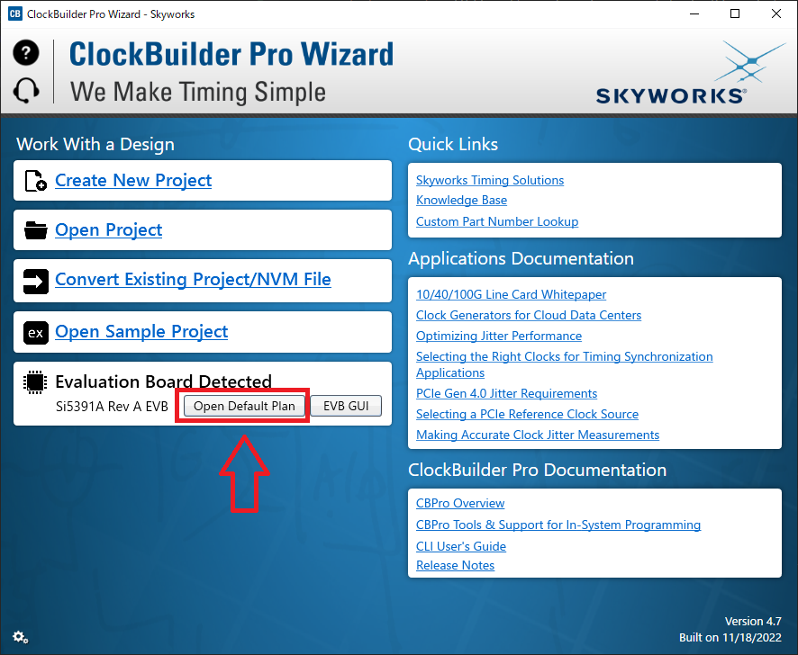
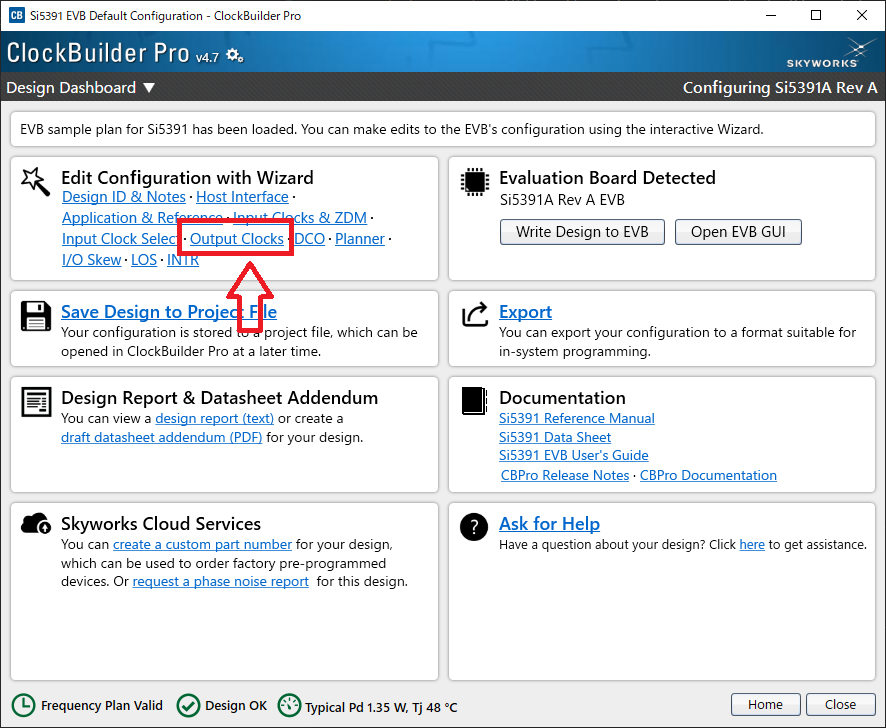
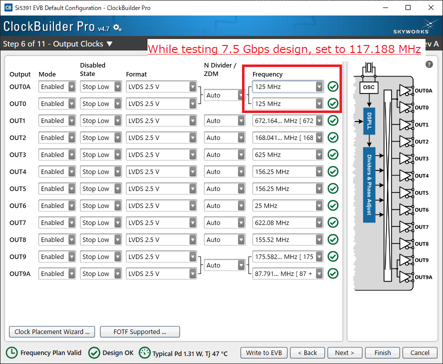
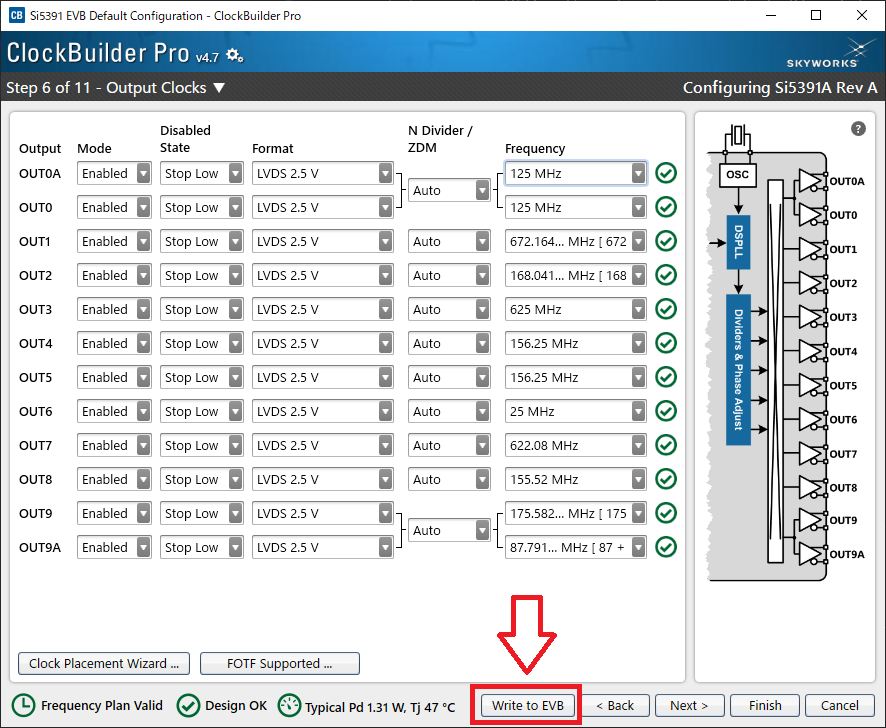

# Clock Board Quick Setup Guide

## Overview

This document provides a quick setup procedure for the [Skyworks Si5391 clock generators](https://www.skyworksinc.com/-/media/Skyworks/SL/documents/public/data-sheets/si5391-datasheet.pdf) and [Skyworks ClockBuilder Pro](https://tools.skyworksinc.com/timingfiles/cbpro/ClockBuilder-Pro-Release-Notes.pdf).

For more information, please refer to the [Si5391 Reference Manual](https://www.skyworksinc.com/-/media/Skyworks/SL/documents/public/reference-manuals/si5391-reference-manual.pdf) and the official documentation.

## Required environment

- [Skyworks Si5391 clock generators](https://www.skyworksinc.com/-/media/Skyworks/SL/documents/public/data-sheets/si5391-datasheet.pdf)
- [Skyworks ClockBuilder Pro](https://tools.skyworksinc.com/timingfiles/cbpro/ClockBuilder-Pro-Release-Notes.pdf) Version 4.7
  - Installed on a Windows 10 PC

Connect the board and the PC with a USB cable.

## Clock setting

1. Execute `ClockBuilder Pro`.
2. Click **Open Default Plan** (Fig. 1).
3. Click **Output Clocks** (Fig. 2).
4. Set **OUT0** and **OUT0A** frequency to **125 MHz** (Fig. 3).
   - While testing the 7.5 Gbps design, set the frequency to **117.188 MHz**.
5. Click **Write to EVB** (Fig. 4).

### Fig. 1

### Fig. 2

### Fig. 3

### Fig. 4

## Troubleshooting

- **"Open Default Plan" does not appear**
  - Please check the connection between the board and the PC.
  - If they are not connected, **Open Default Plan** does not appear.
