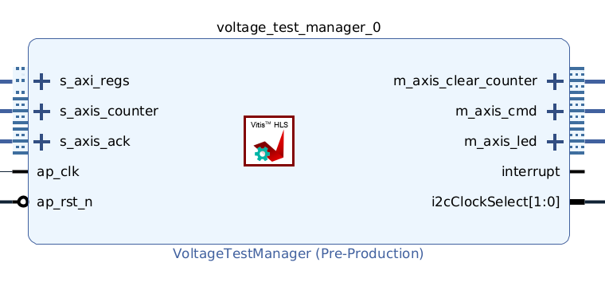
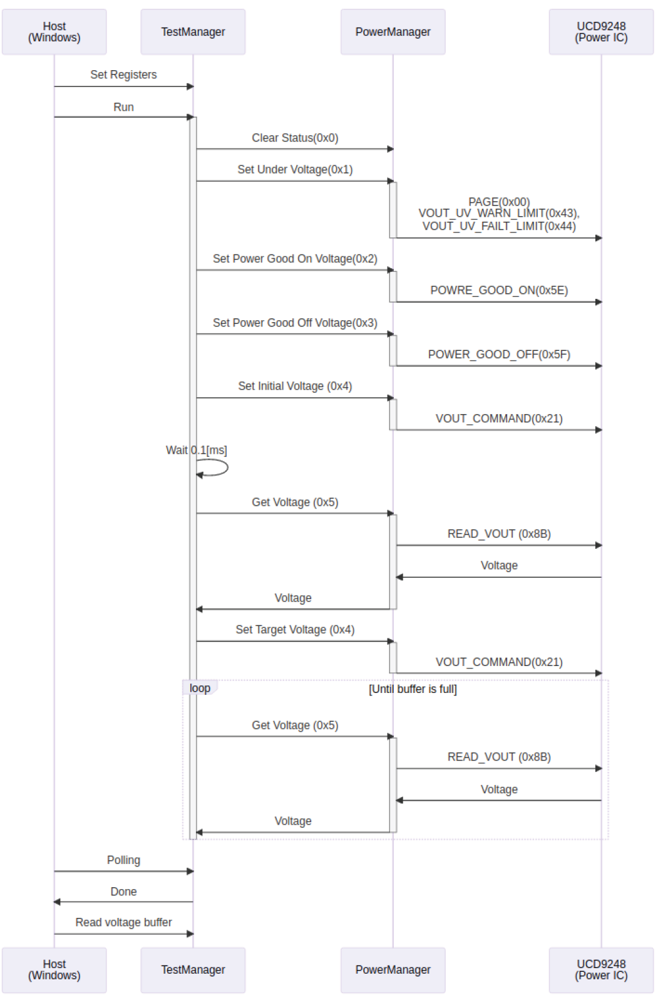

# Voltage-control Designs

This directory contains the Vivado designs used for runtime voltage control and voltage-transition measurement in the VolTune repository.

For PMBus concepts, data formats, command usage, and the subset of PMBus behavior relevant to this repository, see [`../../../docs/PMBUS.md`](../../../docs/PMBUS.md).

These designs are used to characterize the control path itself, including voltage update, voltage readback, and settling-time behavior. The hierarchy includes both a base voltage-measurement design and transceiver-integrated variants, and supports both hardware-based and software-based PMBus control paths.

## Scope

The `voltage/` hierarchy contains designs for:

- **base voltage-control measurement**
- **transceiver-integrated voltage-control designs**
- **multiple transceiver line rates**, 2.5 Gbps, 5 Gbps, 7.5 Gbps, and 10 Gbps
- **two PMBus control implementations**:
  - hardware-based PMBus control
  - software-based PMBus control, under [`sw_pmbus/`](sw_pmbus/)

## Control-path views

### Voltage measurement design



## Measurement sequence



The voltage-control designs follow a host-driven measurement sequence through JTAG register access.

1. The host writes the test registers and starts the measurement flow.
2. The TestManager clears status and programs the PMBus-related threshold settings required for safe voltage control:
   - under-voltage limits
   - power-good on threshold
   - power-good off threshold
3. The initial voltage is written through `VOUT_COMMAND`.
4. After a short wait, the design reads and stores the first monitored voltage value through `READ_VOUT`.
5. The target voltage is written through `VOUT_COMMAND`.
6. The design repeatedly reads `READ_VOUT` and stores sampled voltage values until the monitoring buffer is full.
7. The host polls for completion and then reads back the voltage buffer for settling-time analysis.

The same overall measurement flow is used for both the hardware control path and the software control path. The host-side voltage measurement tool then uses the recorded voltage samples and timing information to analyze transition behavior.

## How to build

⚠️ A licence is required to synthesise this project.

Please set `XILINXD_LICENSE_FILE` environment variables.

```sh
cd <repository top>
./build_device.sh voltage
```

If you want to build them individually, execute the command as follows

```sh
cd <repository top>
mkdir build-evm
cd build-evm
cmake ../device \
  -DVITIS_HLS_ROOT=<VitisHLS Install Directory> \
  -DVIVADO_ROOT=<VivadoHLS Install Directory> \
  -DVITIS_ROOT=<Vitis Install Directory>
make impl_voltage_n000
```

### Make targets

#### Hardware-control targets

- `impl_voltage_n000`
- `impl_voltage_tx_10g`
- `impl_voltage_rx_10g`
- `impl_voltage_loopback_10g`
- `impl_voltage_tx_7p5g`
- `impl_voltage_rx_7p5g`
- `impl_voltage_loopback_7p5g`
- `impl_voltage_tx_5g`
- `impl_voltage_rx_5g`
- `impl_voltage_loopback_5g`
- `impl_voltage_tx_2p5g`
- `impl_voltage_rx_2p5g`
- `impl_voltage_loopback_2p5g`

#### Software-control targets

- `bit_voltage_n000_swpmbus_vitis`
- `bit_voltage_tx_10g_swpmbus_vitis`
- `bit_voltage_rx_10g_swpmbus_vitis`
- `bit_voltage_loopback_10g_swpmbus_vitis`
- `bit_voltage_tx_7p5g_swpmbus_vitis`
- `bit_voltage_rx_7p5g_swpmbus_vitis`
- `bit_voltage_loopback_7p5g_swpmbus_vitis`
- `bit_voltage_tx_5g_swpmbus_vitis`
- `bit_voltage_rx_5g_swpmbus_vitis`
- `bit_voltage_loopback_5g_swpmbus_vitis`
- `bit_voltage_tx_2p5g_swpmbus_vitis`
- `bit_voltage_rx_2p5g_swpmbus_vitis`
- `bit_voltage_loopback_2p5g_swpmbus_vitis`

Note: `impl_voltage_xxx` are HW PowerManager designs. `bit_voltage_xxx` are SW PowerManager designs.

## Bitstream list

### Hardware-control bitstreams

- `hw_n000.bit`
- `hw_l025_c125_000.bit`
- `hw_l050_c125_000.bit`
- `hw_l075_c117_188.bit`
- `hw_l100_c125_000.bit`
- `hw_r025_c125_000.bit`
- `hw_r050_c125_000.bit`
- `hw_r075_c117_188.bit`
- `hw_r100_c125_000.bit`
- `hw_t025_c125_000.bit`
- `hw_t050_c125_000.bit`
- `hw_t075_c117_188.bit`
- `hw_t100_c125_000.bit`

### Software-control bitstreams

- `sw_n000.bit`
- `sw_l025_c125_000.bit`
- `sw_l050_c125_000.bit`
- `sw_l075_c117_188.bit`
- `sw_l100_c125_000.bit`
- `sw_r025_c125_000.bit`
- `sw_r050_c125_000.bit`
- `sw_r075_c117_188.bit`
- `sw_r100_c125_000.bit`
- `sw_t025_c125_000.bit`
- `sw_t050_c125_000.bit`
- `sw_t075_c117_188.bit`
- `sw_t100_c125_000.bit`

## Open Vivado GUI

```sh
make open_voltage_n000
```

## Directories

```text
voltage/
└── sw_pmbus/  # Designs using SW-based PMBus control
```

## Files

- `design_1.tcl`, IP Integrator file
- `design_1_with_transceiver.tcl`, IP Integrator file with transceiver
- `sw_pmbus/design_1.tcl`, SW-based PMBus IP Integrator file
- `sw_pmbus/design_1_with_transceiver.tcl`, SW-based PMBus IP Integrator file with transceiver
- `CMakeLists.txt`, CMake file
- `README.md`, this file

## Related files

- [`../README.md`](../README.md), parent Vivado hierarchy
- [`../power/README.md`](../power/README.md), power-oriented designs
- [`../../../README.md`](../../../README.md), top-level repository overview

## Notes

- This hierarchy is used to characterize the runtime voltage-control mechanism itself, rather than the BER and latency case-study flow.
- The [`sw_pmbus/`](sw_pmbus/) subtree corresponds to the software control path.
- These designs are build-critical. Do not rename packaged IP identifiers, Tcl targets, or integrated design references unless the full build flow has been revalidated.
