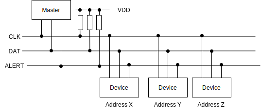
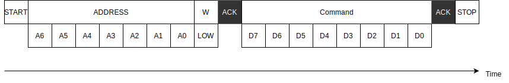
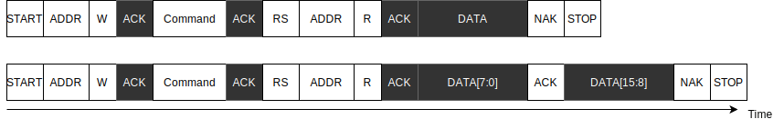
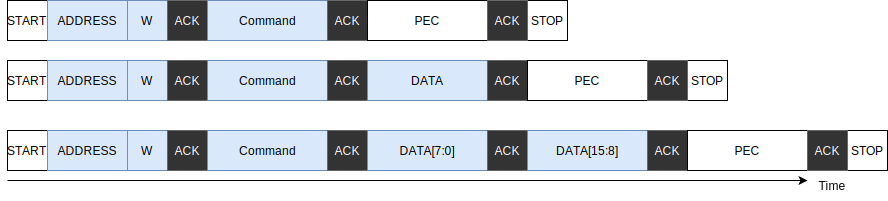
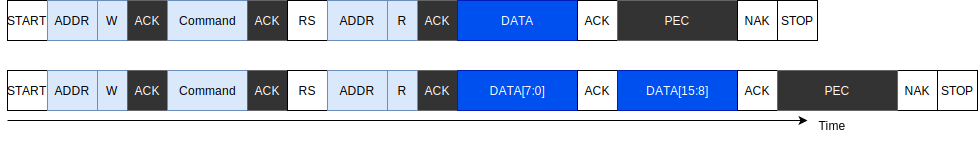
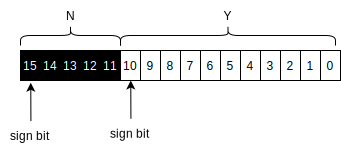
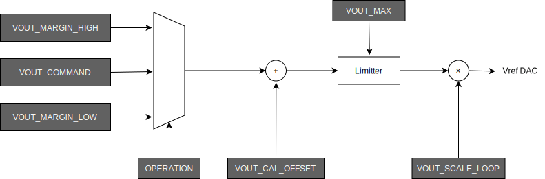

# PMBus Notes for VolTune

This document provides a brief PMBus overview for the VolTune repository. It reflects the KC705 + UCD9248 prototype used in this repository. Porting to another PMBus-controlled platform may require adapting rail mapping, command sequencing, and voltage encoding or decoding behavior, including regulator-specific handling such as `VOUT_MODE`.

It is derived from the original PMBus design notes included in the source repository and focuses only on the parts of PMBus that are actually relevant to VolTune, voltage control, voltage readback, and power/current monitoring.

For the full protocol details, please refer to the official specifications:

- [PMBus Power System Management Protocol, Part I, General Requirements, Version 1.1](https://pmbusprod.wpenginepowered.com/wp-content/uploads/2021/05/PMBus-Specification-Rev-1-1-Part-I-20070205.pdf)
- [PMBus Power System Management Protocol, Part II, Command Language, Version 1.1](https://pmbusprod.wpenginepowered.com/wp-content/uploads/2021/05/PMBus-Specification-Rev-1-1-Part-II-20070205.pdf)
- [System Management Bus (SMBus) Specification Version 2.0](http://smbus.org/specs/smbus20.pdf)

## PMBus basics

PMBus is defined as an extension of SMBus.

SMBus uses I²C as the communication standard, and an ALERT line is added to notify failures and related events. The handling of clock and data lines and communication timing is the same as in I²C.

PMBus defines bus speeds of 100 kHz and 400 kHz. Some devices support up to 1 MHz. Refer to the datasheet of each device for supported transfer speeds.

## PMBus clock settings in this repository

At the PMBus protocol level, the original design notes describe **100 kHz** and **400 kHz** as standard PMBus bus speeds, and note that some devices support **up to 1 MHz**. The PMBus module in this repository also exposes three clock-select settings:

- `0`: 100 kHz
- `1`: 400 kHz
- `2`: 1 MHz

However, the current VolTune controller characterization and evaluation focus on **100 kHz** and **400 kHz** PMBus operation. These are the PMBus clock settings used in the current paper-level evaluation of control latency and measurement granularity.

### PMBus lines



Each device has a different 7-bit address, which the host uses to select the device it wants to communicate with.

### Send Byte protocol

The simplest protocol for sending a command is the Send Byte protocol.



In the figure:

- white rectangles show data sent by the Master
- black rectangles show data sent by the Device
- `An` indicates the `n`th address bit
- `Dn` indicates the `n`th data bit
- `W` means write
- `LOW` means `0`

`ACK` is the response from the Device:

- `LOW` means `ACK`, normal response
- `HIGH` means `NAK`, communication failure

In I²C and SMBus, data is transmitted from the upper bits first.

One important point is that a device may force the master to wait by holding the clock line LOW, especially around acknowledge timing. This is called a **Busy Condition**. The master should not assume that timing always follows its own generated clock and should check the actual state of the clock pins.

### Write Byte / Write Word protocol

If data is needed to execute the command, the host sends it with the Write Byte / Write Word protocol.


### Read Byte / Read Word protocol

If the command returns a result, the host receives it with the Read Byte / Read Word protocol.



In the figure:

- `RS` means Repeat-Start
- `R` means Read, value `1`
- `ACK` returned by the Master is `LOW`
- `NAK` returned by the Master is `HIGH`

## Packet Error Check, PEC

Packet Error Check, PEC, is CRC8 data used to verify that the transmitted data is correct.

The polynomial used in PEC CRC8 is:

`x^8 + x^2 + x + 1`

The initial CRC8 value is `0`. Input bits are processed in received-bit order, upper bits first, and XOR is not performed on output.

Example C code for CRC8 calculation:

```c
uint8_t calculateCRC(uint8_t x, uint8_t crc) {
  for (int i = 7; i >= 0; i--) {
    bool div = ((crc >> 7) ^ (x >> i)) & 0x1;
    crc = crc << 1;
    if (div) crc ^= 7; // x^2 + x + 1 => 0b00000111 = 7
  }
  return crc;
}

uint8_t calculateCRCArray(uint8_t data[], size_t len) {
  uint8_t crc = 0;
  for (size_t i = 0; i < len; i++)
    crc = calculateCRC(data[i], crc);
  return crc;
}
```

The data used to calculate PEC includes all transferred data except:

- START
- STOP
- RE-START
- ACK

The following protocols show the PEC-enhanced forms of the normal write and read protocols.

### Write protocol with PEC



### Read protocol with PEC



## Data formats used in VolTune

## LINEAR16 format

The LINEAR16 format is used to represent voltages in PMBus.

The PMBus specification defines both the LINEAR16 format and the LINEAR11 format as members of the LINEAR data format family. The names LINEAR16 and LINEAR11 are commonly used in Texas Instruments datasheets and are used here for clarity.

LINEAR16 is a 16-bit fixed-point format.

The voltage `V` is expressed from the 16-bit value `v` and fixed-point factor `x` as:

```text
V = 2^x * v
```

For the UCD9248PFC used on the KC705 platform, `x = -12`.

This value can also be obtained from the PMBus `VOUT_MODE` command.

## LINEAR11 format

The LINEAR11 format is a 16-bit floating-point format used to represent values such as current, power, and temperature.

The 16-bit value consists of `N` and `Y`, both expressed in signed two's complement form.



The represented value `X` is:

```text
X = 2^N * Y
```

In VolTune:

- voltage values are primarily handled in LINEAR16
- current and power readback values are primarily handled in LINEAR11

## PMBus command subset used by VolTune

PMBus defines many commands, but only a small subset is relevant here.

## PAGE command

The most important command is `PAGE`.

This command selects which power rail subsequent commands operate on. The UCD9248PFC on the KC705 can control multiple power rails. Each rail has its own settings, including output voltage and related thresholds.

All commands listed below are interpreted relative to the rail selected by `PAGE`.

| Command Name | Command | Protocol | Data |
| --- | --- | --- | --- |
| PAGE | `0x00` | Write Byte | Page Number |

## Set-voltage-related commands

Several PMBus commands are involved in adjusting output voltage.



The voltage adjustment flow is:

1. Select `VOUT_COMMAND` or `VOUT_MARGIN_HIGH/LOW` from `OPERATION`
2. Add `VOUT_CAL_OFFSET`
3. Saturate with `VOUT_MAX`
4. Multiply by `VOUT_SCALE_LOOP` and output to DAC

`VOUT_MARGIN_HIGH/LOW` is mainly intended for voltage margining and is not normally used in this project. In practice, VolTune changes output voltage primarily through `VOUT_COMMAND`.

### Important safety note

When changing output voltage, the threshold settings must remain valid. If Under Voltage, Over Voltage, or Power Good thresholds are not set appropriately, voltage output may stop depending on the power controller configuration.

- **Under Voltage, UV** defines the lower voltage limit
- **Over Voltage, OV** defines the upper voltage limit
- **Power Good, PGOOD** defines the threshold for considering the output voltage valid

In this project, when intentionally lowering voltage below the nominal value, the UV and PGOOD settings must be adjusted first.

The recommended procedure is:

1. Change the Under Voltage settings to values lower than the target voltage
   - `VOUT_UV_WARN_LIMIT`
   - `VOUT_UV_FAULT_LIMIT`
2. Change the Power Good settings to values lower than the target voltage
   - `POWER_GOOD_ON`
   - `POWER_GOOD_OFF`
3. Change the output voltage
   - `VOUT_COMMAND`

The OV thresholds should not be changed.

### Voltage-setting command subset

| Command Name | Command | Protocol | Data |
| --- | --- | --- | --- |
| VOUT_COMMAND | `0x21` | Write Word | LINEAR16 [V] |
| VOUT_UV_WARN_LIMIT | `0x43` | Write Word | LINEAR16 [V] |
| VOUT_UV_FAULT_LIMIT | `0x44` | Write Word | LINEAR16 [V] |
| POWER_GOOD_ON | `0x5E` | Write Word | LINEAR16 [V] |
| POWER_GOOD_OFF | `0x5F` | Write Word | LINEAR16 [V] |

The threshold-update sequence described here reflects the prototype KC705 workflow. It should not be interpreted as a universal PMBus bring-up sequence for all regulators.

## Readback commands

VolTune also uses PMBus readback commands to observe voltage, current, and power.

| Command Name | Command | Protocol | Data | Description |
| --- | --- | --- | --- | --- |
| READ_VOUT | `0x8B` | Read Word | LINEAR16 [V] | Get output voltage |
| READ_IOUT | `0x8C` | Read Word | LINEAR11 [A] | Get output current |
| READ_POUT | `0x96` | Read Word | LINEAR11 [W] | Get output power |

## Relevance to VolTune

In VolTune, PMBus is the low-level control and monitoring interface behind the runtime voltage-control path.

At the repository level, the most important practical points are:

- PMBus commands operate on the currently selected `PAGE`
- voltage writes use LINEAR16
- current and power readback use LINEAR11
- PEC may be required depending on the control path and device interaction
- safe voltage updates require threshold updates before `VOUT_COMMAND` when lowering voltage intentionally

## Related files

- [`../README.md`](../README.md), top-level repository overview
- [`../device/rtl/README.md`](../device/rtl/README.md), PMBus-related RTL modules
- [`../device/vivado/voltage/README.md`](../device/vivado/voltage/README.md), voltage-control designs
- [`../device/vivado/power/README.md`](../device/vivado/power/README.md), power-oriented designs
