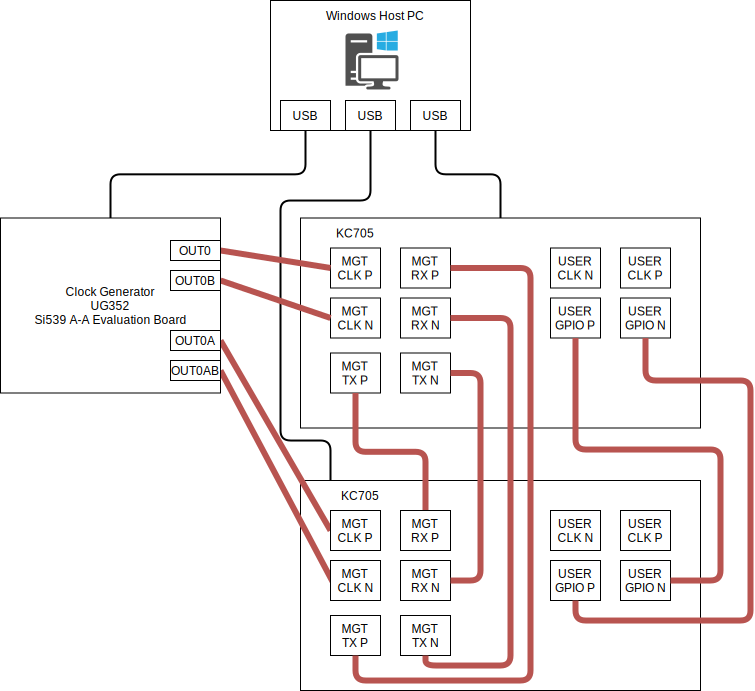

# Host-side Software

This directory contains the host-side software used to control, execute, and collect measurements from the VolTune FPGA designs.

The host-side flow is intended to run on a Windows machine with MSYS2 and Xilinx runtime tools. It provides the user-facing executables for voltage-transition measurement, BER and power measurement, and the XSDB-based interaction layer used to communicate with the FPGA platform.

## Environment

### Software

- Windows 10
- MSYS2
- gcc
- CMake 3.16 or newer
- Make
- Vivado Lab 2022.1 or Vivado 2022.1
- `hw_server`
- `xsdb`
- Skyworks ClockBuilder Pro Version 4.7

### Hardware

- 2x [Xilinx Kintex-7 FPGA KC705 Evaluation Kit](https://www.xilinx.com/products/boards-and-kits/ek-k7-kc705-g.html)
- TI UCD9248-based power control platform
- 1x [Skyworks Si5391 clock generators](https://www.skyworksinc.com/-/media/Skyworks/SL/documents/public/data-sheets/si5391-datasheet.pdf)
- Xilinx Platform Cable USB II

## Directory structure

```text
host/
├── power/         # BER, latency, and rail-power measurement tool
├── voltage/       # Voltage-transition measurement tool
├── evm/           # Auxiliary host-side utilities
└── xsdb_wrapper/  # XSDB interaction layer
```

## Main components

### `power/`

This directory contains the host-side measurement program used for BER, latency, and rail-power experiments.

See also:

- [`power/README.md`](power/README.md)

### `voltage/`

This directory contains the host-side measurement program used for voltage-transition and settling-time experiments.

See also:

- [`voltage/README.md`](voltage/README.md)

### `evm/`

This directory contains auxiliary host-side programs used for additional board-level measurements and support tasks.

### `xsdb_wrapper/`

This directory contains the XSDB wrapper library used by the host-side tools to interact with the FPGA platform.

See also:

- [`xsdb_wrapper/README.md`](xsdb_wrapper/README.md)

## Build

From the repository root, the host-side tools can be built in the MSYS2 MinGW64 shell with:

```bash
./msys_install.sh
./msys_build.sh
```

After a successful build, the main executables are generated under:

```text
build/bin/
```

Representative outputs include:

- `build/bin/voltage-measure.exe`
- `build/bin/power-measure.exe`

## Board setup

The host-side measurement flow assumes a Windows Host PC connected to two KC705 boards and a Skyworks Si5391A-A evaluation board.

- The Host PC controls the KC705 boards through JTAG using `hw_server` and `xsdb`.
- The clock board is configured using ClockBuilder Pro.
- The clock board provides the external reference clocks for the transceiver experiments.
- In the standard setup, use **125.000 MHz** for 2.5 Gbps, 5 Gbps, and 10 Gbps tests, and **117.188 MHz** for 7.5 Gbps tests.



## Notes

- This directory contains the host-side software only. FPGA-side designs are under the `device/` hierarchy.
- The host-side flow depends on the corresponding FPGA bitstreams and board setup being prepared correctly.
- Detailed run procedures and tool-specific options are described in the child README files under `power/` and `voltage/`.
- The host-side flow assumes this board connection is prepared before running the measurement tools.
- When using XSDB, connect no more than two KC705 boards to the same Host PC.
